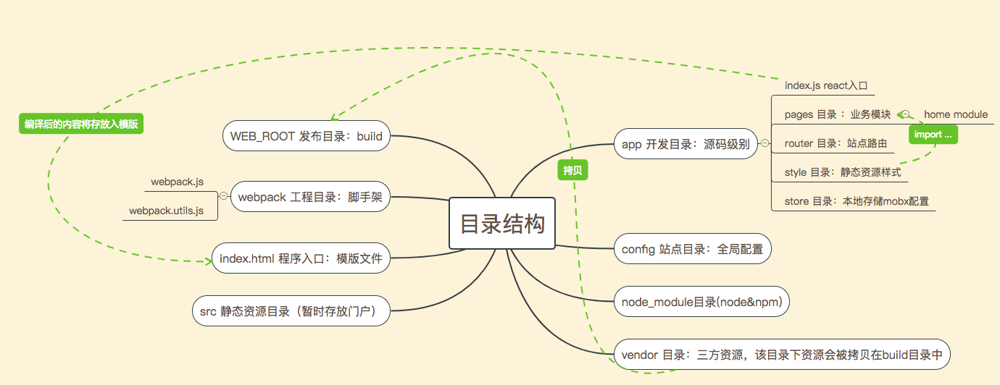
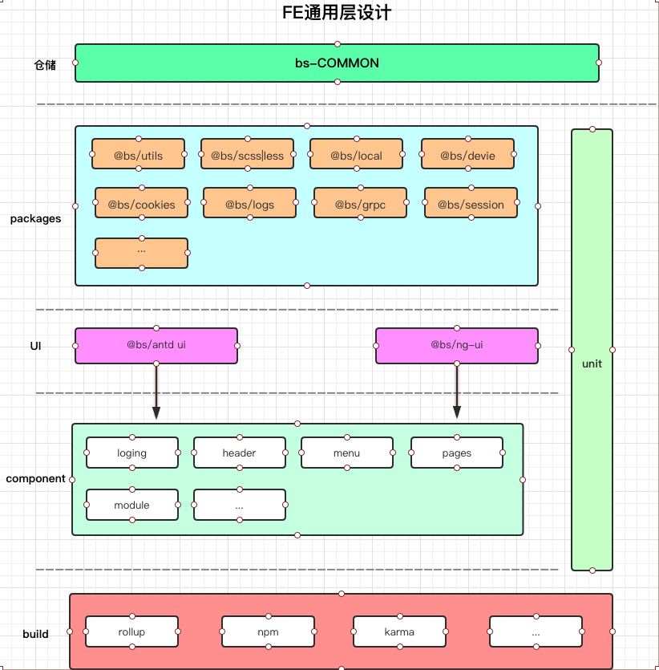

技术栈
----------------------------

react + router + mobx + antd + i18n 详细 NPM 包 参见:`package.json` 

未完待续...

项目目录结构
-----------------



FE通用层设计
-----------------



使用方法
-----------------
##git clone https://git.biss.com/bts/website.git


```
进入项目目录 cd website 
安装依赖 npm install (推荐使用yarn 或者将npm 镜像到淘宝的)
淘宝镜像：$ npm install -g cnpm --registry=https://registry.npm.taobao.org
运行项目-开发环境 npm dev    
打包项目-生产环境 npm build 

单元测试 npm run test

```


-----------------------------------------